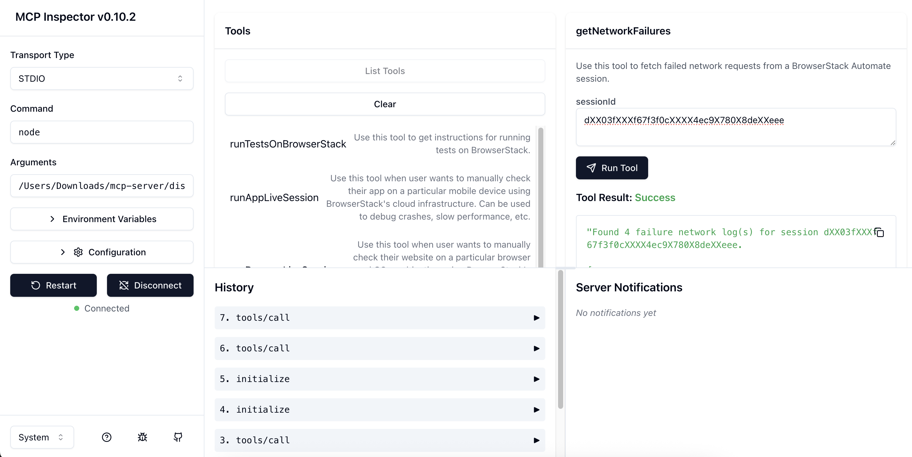

# 🚀 Contributing to the Browserstack MCP Server

This guide will help you set up your environment and contribute effectively to the MCP (Model Context Protocol) Server.

## ✅ Prerequisites

Make sure you have the following installed:

- 🟢 [Node.js](https://nodejs.org/) (Recommended: LTS v22.15.0)
- 🤖 GitHub Copilot (for VS Code or Cursor)
- 🧠 Optionally, [Claude desktop app](https://www.anthropic.com/index/claude-desktop) for additional AI assistance

## 🛠 Getting Started

1. **Clone the repository:**

   ```bash
   git clone https://github.com/browserstack/mcp-server.git
   cd mcp-server
   ```

2. **Build the project:**

   ```bash
   npm run build
   ```

   This compiles the TypeScript source code and generates `dist/index.js`.

3. **Configure MCP for your editor:**

### 💻 VS Code: `.vscode/mcp.json`

```json
{
  "servers": {
    "browserstack": {
      "command": "node",
      "args": ["FULL PATH TO dist/index.js"],
      "env": {
        "BROWSERSTACK_USERNAME": "<your_username>",
        "BROWSERSTACK_ACCESS_KEY": "<your_access_key>"
      }
    }
  }
}
```

### 🖱 Cursor: `.cursor/mcp.json`

```json
{
  "mcpServers": {
    "browserstack": {
      "command": "node",
      "args": ["FULL PATH TO dist/index.js"],
      "env": {
        "BROWSERSTACK_USERNAME": "<your_username>",
        "BROWSERSTACK_ACCESS_KEY": "<your_access_key>"
      }
    }
  }
}
```

### 🔨 Quick Start from VS Code or Cursor

When you open your `.vscode/mcp.json` or `.cursor/mcp.json` file,  
you'll see a **"play" icon** (Start ▶️) next to the server configuration.  
**Click it to instantly start your MCP server!**


## 🧪 How to Test with MCP Inspector

**MCP Inspector** is a lightweight tool for launching, testing, and validating MCP server implementations easily.

### 🔹 Run with Config

If you've configured `.cursor/mcp.json` or `.vscode/mcp.json`, you can start testing by running:

```bash
npx @modelcontextprotocol/inspector --config /PATH_TO_CONFIG/.cursor/mcp.json --server browserstack
```

This will spin up your MCP server and open the Inspector at:  
[http://127.0.0.1:6274](http://127.0.0.1:6274)

<div align="center">

</div>

Inside the Inspector:

- View and manage your server connection (restart, disconnect, etc.)
- Validate your server credentials and environment variables
- Access available tools under the **"Middle Tab"**, and run tests to see results in the **Right Panel**
- Review past interactions easily via the **History Panel**

Additionally, for every MCP server session, a log file is automatically generated at:  
`~/Library/Logs/Claude/` — you can check detailed logs there if needed.

---

## ✨ Next Steps

🌀 Fork the repository to your GitHub account

🧩 Add tests to verify your contributions

🤖 Explore and interact with the server using Copilot, Cursor, or Claude

📬 Raise a pull request from your fork once you're ready!
