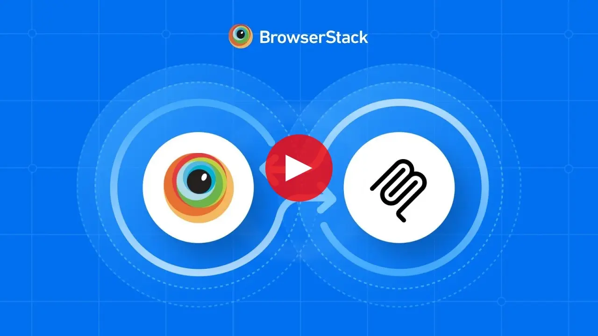
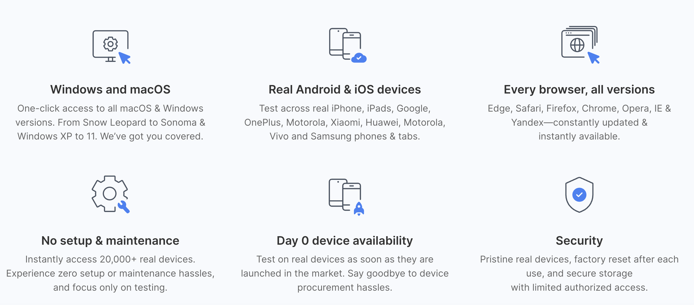
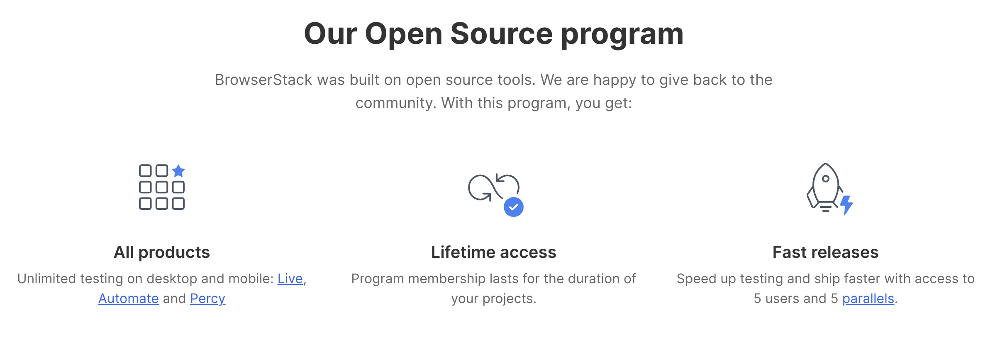
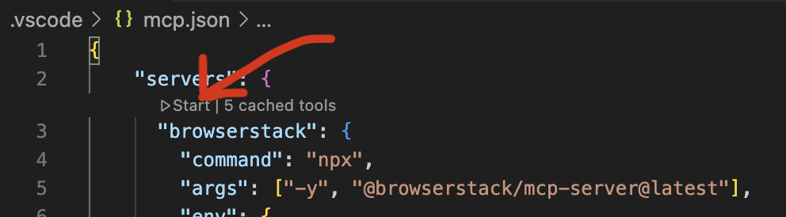

# BrowserStack MCP Server

<div align="center">
 
</div>


<div align="center">
<a href="https://www.npmjs.com/package/@browserstack/mcp-server">

</a>

</div>

<p align="center">One Platform For All Your Testing Needs</p>

<div align="center">
<a href="https://glama.ai/mcp/servers/@browserstack/mcp-server">
  
</a>
</div>

<div>
    <a href="https://www.youtube.com/watch?v=sLA7K9v7qZc">
      
    </a>
  </div>
  
Enable every developer and tester in your team, whether they are testing manually, starting their automation journey, or scaling test automation.
BrowserStack MCP Server allows you to use our cutting-edge [Test Platform](https://www.browserstack.com/test-platform) directly from your favourite AI tools.

### Why BrowserStack ?

<p align="center">
  
</p>

## 💡 Usage Examples

### 📱 Manual App Testing

Use the following prompts to use your **mobile apps** on BrowserStack's extensive cloud of real devices. Stop using emulators!

```bash
# Open app on specific device
"open my app on a iPhone 15 Pro Max"

# Debug app crashes
"My app crashed on Android 14 device, can you help me debug?"
```


- Unlike emulators, test your app's real-world performance on actual devices. With advanced [App-Profiling features](https://www.browserstack.com/docs/app-live/app-performance-testing), you can debug crashes and performance issues in real-time.
- Access all major devices and OS versions from our [device grid](https://www.browserstack.com/list-of-browsers-and-platforms/app_live), We have strict SLAs to provision our global datacenters with newly released devices on [launch day](https://www.browserstack.com/blog/browserstack-launches-iphone-15-on-day-0-behind-the-scenes/).

### 🌐 Manual Web Testing

Similar to the app testing, you can use the following prompts to test your **websites** on BrowserStack's extensive cloud of real browsers and devices. Don't have Edge browser installed on your machine ? We've got you covered!

```bash
# Test your local websites
"open my website hosted on localhost:3001 on Edge"
```

- Test websites across different browsers and devices. We support [every major browser](https://www.browserstack.com/list-of-browsers-and-platforms/live) across every major OS.
- Seamlessly test websites hosted locally on your machine, no need to deploy to a remote server!

### 🧪 Automated Testing (Playwright, Selenium, A11y and more..)

Use the following prompts to run/debug/fix your **automated tests** on BrowserStack's [Test Platform](https://www.browserstack.com/test-platform).

```bash
# Port test suite to BrowserStack
"run my test suite on BrowserStack infra"

# Debug test failures
"My test suite failed, can you help me fix the new failures?"

# Accessibility testing
"check for accessibility issues on my www.mywebsite.com"
```

- Fix test failures reported by your CI/CD pipeline by utilising our industry leading [Test Observability](https://www.browserstack.com/docs/test-observability) features. Find more info [here](https://www.browserstack.com/docs/test-observability/features/smart-tags).
- Run tests written in Jest, Playwright, Selenium, and more on BrowserStack's [Test Platform](https://www.browserstack.com/test-platform)
- **Accessibility Testing**: Ensure WCAG and ADA compliance with our [Accessibility Testing](https://www.browserstack.com/accessibility-testing) tool


### 📋 Test Management 

Use the following prompts to utilise capabilities of BrowserStack's [Test Management](https://www.browserstack.com/test-management) with MCP server.

```bash
# Create project & folder structure
"create new Test management project named My Demo Project with two sub folders - Login & Checkout"

# Add test cases
"add invalid login test case in Test Management project named My Demo Project"

# List added test cases 
"list high priority Login test cases from Test Management project - My Demo Project"

# Create test run
"create a test run for Login tests from Test Management project - My Demo Project"

# Update test results
"update test results as passed for Login tests test run from My Demo Project"
```

## 🛠️ Installation

1. **Create a BrowserStack Account**

   - Sign up for [BrowserStack](https://www.browserstack.com/users/sign_up) if you don't have an account already.

   - ℹ️ If you have an open-source project, we'll be able to provide you with a [free plan](https://www.browserstack.com/open-source).
   <div align="center">
   
   </div>

   - Once you have an account (and purchased appropriate plan), note down your `username` and `access_key` from [Account Settings](https://www.browserstack.com/accounts/profile/details).

2. Ensure you are using Node version >= `18.0`. Check your node version using `node --version`. Recommended version: `v22.15.0` (LTS)
3. **Install the MCP Server**

   - VSCode (Copilot - Agent Mode): `.vscode/mcp.json`:

   ```json
   {
     "servers": {
       "browserstack": {
         "command": "npx",
         "args": ["-y", "@browserstack/mcp-server@latest"],
         "env": {
           "BROWSERSTACK_USERNAME": "<username>",
           "BROWSERSTACK_ACCESS_KEY": "<access_key>"
         }
       }
     }
   }
   ```

   - In VSCode, make sure to click on `Start` button in the MCP Server to start the server.
     

   * For Cursor: `.cursor/mcp.json`:

   ```json
   {
     "mcpServers": {
       "browserstack": {
         "command": "npx",
         "args": ["-y", "@browserstack/mcp-server@latest"],
         "env": {
           "BROWSERSTACK_USERNAME": "<username>",
           "BROWSERSTACK_ACCESS_KEY": "<access_key>"
         }
       }
     }
   }
   ```

   - Claude Desktop: `~/claude_desktop_config.json`:

   ```json
   {
     "mcpServers": {
       "browserstack": {
         "command": "npx",
         "args": ["-y", "@browserstack/mcp-server@latest"],
         "env": {
           "BROWSERSTACK_USERNAME": "<username>",
           "BROWSERSTACK_ACCESS_KEY": "<access_key>"
         }
       }
     }
   }
   ```

### Installing via Smithery

To install BrowserStack Test Platform Server for Claude Desktop automatically via [Smithery](https://smithery.ai/server/@browserstack/mcp-server):

```bash
npx -y @smithery/cli install @browserstack/mcp-server --client claude
```

## 🤝 Recommended MCP Clients

- We recommend using **Github Copilot or Cursor** for automated testing + debugging use cases.
- For manual testing use cases (Live Testing), we recommend using **Claude Desktop**.

## ⚠️ Important Notes

- The BrowserStack MCP Server is under active development and currently supports a subset of the MCP spec. More features will be added soon.
- Tool invocations rely on the MCP Client which in turn relies on an LLM, hence there can be some non-deterministic behaviour that can lead to unexpected results. If you have any suggestions or feedback, please open an issue to discuss.

## 📝 Contributing

We welcome contributions! Please open an issue to discuss any changes you'd like to make.
👉 [**Click here to view our Contributing Guidelines**](https://github.com/browserstack/mcp-server/blob/main/CONTRIBUTING.md)

## 📞 Support

For support, please:

- Check our [documentation](https://www.browserstack.com/docs)
- Open an issue in our [GitHub repository](https://github.com/browserstack/mcp-server) if you face any issues related to the MCP Server.
- Contact our [support team](https://www.browserstack.com/contact) for any other queries.

## 🚀 More Features Coming Soon

Stay tuned for exciting updates! Have any suggestions? Please open an issue to discuss.

## 🔗 Resources

- [BrowserStack Test Platform](https://www.browserstack.com/test-platform)
- [MCP Protocol Documentation](https://modelcontextprotocol.io)
- [Device Grid](https://www.browserstack.com/list-of-browsers-and-platforms/app_live)
- [Accessibility Testing](https://www.browserstack.com/accessibility-testing)
