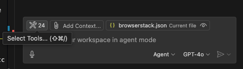
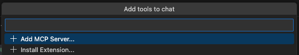
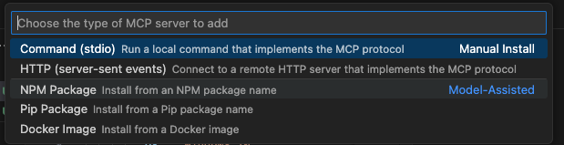
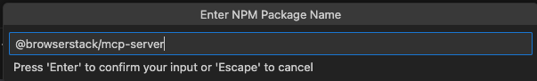

# BrowserStack MCP Server

<div align="center">
 
</div>


<div align="center">
<a href="https://www.npmjs.com/package/@browserstack/mcp-server">

</a>

</div>

<p align="center">Comprehensive Test Platform</p>

<div align="center">
<a href="https://glama.ai/mcp/servers/@browserstack/mcp-server">
  
</a>
</div>

<div>
    <a href="https://www.youtube.com/watch?v=sLA7K9v7qZc&list=PL1vH6dHT3H7oy8w9CY6L_nxGxCc89VXMX&index=5">
      
    </a>
  </div>

  
Manage test cases, execute manual or automated tests, debug issues, and even fix code—directly within tools like Cursor, Claude, or any MCP-enabled client, using plain English.
#### Test from anywhere:
Easily connect the BrowserStack Test Platform to your favourite AI tools, such as IDEs, LLMs, or agentic workflows.
#### Test with natural language:
Manage, execute, debug tests, and even fix code using plain English prompts.
#### Reduced context switching:
Stay in flow—keep all project context in one place and trigger actions directly from your IDE or LLM.

## ⚡️ One Click MCP Setup

[](http://mcp.browserstack.com/one-click-setup?client=vscode) &nbsp; [](http://mcp.browserstack.com/one-click-setup?client=cursor)

## 💡 Usage Examples

### 📱 Manual App Testing

Test mobile apps on real devices across the latest OS versions. Reproduce bugs and debug crashes without setup hassles.
Below are some sample prompts to use your mobile apps on BrowserStack's extensive cloud of real devices
```bash
# Open app on specific device
"open my app on a iPhone 15 Pro Max"

# Debug app crashes
"My app crashed on Android 14 device, can you help me debug?"
```

- Unlike emulators, test your app's real-world performance on actual devices. With advanced [App-Profiling features](https://www.browserstack.com/docs/app-live/app-performance-testing), you can debug crashes and performance issues in real-time.
- Access all major devices and OS versions from our [device grid](https://www.browserstack.com/list-of-browsers-and-platforms/app_live), We have strict SLAs to provision our global datacenters with newly released devices on [launch day](https://www.browserstack.com/blog/browserstack-launches-iphone-15-on-day-0-behind-the-scenes/).

### 🌐 Manual Web Testing

Similar to the app testing, you can use the following prompts to test your **websites** on BrowserStack's extensive cloud of real browsers and devices. Don't have Edge browser installed on your machine ? We've got you covered!

```bash
# Test your websites
"open my website hosted on localhost:3001 on Edge"
"open browserstack.com on latest version of Chrome"
```

- Test websites across different browsers and devices. We support [every major browser](https://www.browserstack.com/list-of-browsers-and-platforms/live) across every major OS.
- Seamlessly test websites hosted locally on your machine, no need to deploy to a remote server!

### 🧪 Automated Testing (Playwright, Selenium, A11y and more..)

Auto-analyze, diagnose, and even fix broken test scripts right in your IDE or LLM. Instantly fetch logs, identify root causes, and apply context-aware fixes. No more debugging loops.
Below are few example prompts to run/debug/fix your automated tests on BrowserStack's [Test Platform](https://www.browserstack.com/test-platform).

```bash
#Port test suite to BrowserStack
"Setup test suite to run on BrowserStack infra"

#Run tests on BrowserStack
“Run my tests on BrowserStack”

#AI powered debugging of test failures
"My App Automate tests have failed, can you help me fix the new failures?"

```
- Fix test failures reported by your CI/CD pipeline by utilising our industry leading [Test Observability](https://www.browserstack.com/docs/test-observability) features. Find more info [here](https://www.browserstack.com/docs/test-observability/features/smart-tags).
- Run tests written in Jest, Playwright, Selenium, and more on BrowserStack's [Test Platform](https://www.browserstack.com/test-platform)

### 🌐 Accessibility

Catch accessibility issues early with automated, local a11y scans. Get one-click, AI-suggested fixes. No docs hunting, no CI surprises. Ensure WCAG and ADA compliance with our Accessibility Testing tool

```bash
#Scan accessibility issues while development
"Scan & help fix accessibility issues for my website running locally on localhost:3000"

#Scan accessibility issues on production site
“Run accessibility scan & identify issues on my website - www.bstackdemo.com”

```

### 📋 Test Management 

Create and manage test cases, create test plans and trigger test runs using natural language. Below are a few example prompts to utilise capabilities of BrowserStack's [Test Management](https://www.browserstack.com/test-management) with MCP server.

```bash
# Create project & folder structure
"create new Test management project named My Demo Project with two sub folders - Login & Checkout"

# Add test cases
"add invalid login test case in Test Management project named My Demo Project"

# List added test cases 
"list high priority Login test cases from Test Management project - My Demo Project"

# Create test run
"create a test run for Login tests from Test Management project - My Demo Project"

# Update test results
"update test results as passed for Login tests test run from My Demo Project"
```

### 🧪 Access BrowserStack AI agents 

Generate test cases from PRDs, convert manual tests to low-code automation, and auto-heal flaky scripts powered by BrowserStack’s AI agents, seamlessly integrated into your workflow.  Below are few example prompts to access Browserstack AI agents

```bash
#Test case generator agent
"With Browserstack AI, create relevant test cases for my PRD located at /usr/file/location"


#Low code authoring agent
“With Browserstack AI, automate my manual test case X, added in Test Management”


#Self healing agent
“Help fix flaky tests in my test script with Browserstack AI self healing”
```


## 🛠️ Installation

### **One Click MCP Setup**

[](http://mcp.browserstack.com/one-click-setup?client=vscode) &nbsp; [](http://mcp.browserstack.com/one-click-setup?client=cursor)


### **Alternate ways to Setup MCP server**

1. **Create a BrowserStack Account**

   - Sign up for [BrowserStack](https://www.browserstack.com/users/sign_up) if you don't have an account already.

   - ℹ️ If you have an open-source project, we'll be able to provide you with a [free plan](https://www.browserstack.com/open-source).
   

   - Once you have an account (and purchased appropriate plan), note down your `username` and `access_key` from [Account Settings](https://www.browserstack.com/accounts/profile/details).

2. Ensure you are using Node version >= `18.0`. Check your node version using `node --version`. Recommended version: `v22.15.0` (LTS)

3. **Install the MCP Server**

   - VSCode (Copilot - Agent Mode): `.vscode/mcp.json`:
    
      - Locate or Create the Configuration File: 
        In the root directory of your project, look for a folder named .vscode. This folder is usually hidden so you will need to find it as mentioned in the expand.
    
      - If this folder doesn't exist, create it.
    
      - Inside the .vscode folder, create a new file named mcp.json
      
      - Add the Configuration: Open the mcp.json file and then add the  following JSON content. 
      
      - Replace the username and <access_key> with your BrowserStack   credentials.

   ```json
   {
     "servers": {
       "browserstack": {
         "command": "npx",
         "args": ["-y", "@browserstack/mcp-server@latest"],
         "env": {
           "BROWSERSTACK_USERNAME": "<username>",
           "BROWSERSTACK_ACCESS_KEY": "<access_key>"
         }
       }
     }
   }
   ```

   - In VSCode, make sure to click on `Start` button in the MCP Server to start the server.
     

   
   #### ** Alternate way to setup MCP on VSCode Copilot

   1.Click on the gear icon to Select Tools
    <div align="center">
       
    </div>
   2. A tool menu would appear at the top-centre, scroll down on the     menu at the top and then Click on Add MCP Server
    <div align="center">
       
    </div>
   3. Select NPM package option (Install fron an NPM package) - 3rd in the list
    <div align="center">
       
    </div>
   4. Enter NPM Package Name (@browserstack/mcp-server)
    <div align="center">
       
    </div>
   5. Enter browserstack user name and access key
   
   
   
   
   * For Cursor: `.cursor/mcp.json`:

   ```json
   {
     "mcpServers": {
       "browserstack": {
         "command": "npx",
         "args": ["-y", "@browserstack/mcp-server@latest"],
         "env": {
           "BROWSERSTACK_USERNAME": "<username>",
           "BROWSERSTACK_ACCESS_KEY": "<access_key>"
         }
       }
     }
   }
   ```

   - Claude Desktop: `~/claude_desktop_config.json`:

   ```json
   {
     "mcpServers": {
       "browserstack": {
         "command": "npx",
         "args": ["-y", "@browserstack/mcp-server@latest"],
         "env": {
           "BROWSERSTACK_USERNAME": "<username>",
           "BROWSERSTACK_ACCESS_KEY": "<access_key>"
         }
       }
     }
   }
   ```
   - Cline
     
Click the “MCP Servers” icon in the navigation bar
Select the “Installed” tab. Click the “Configure MCP Servers” button at the bottom of the pane.

   ```json
   {
     "mcpServers": {
       "browserstack": {
         "command": "npx",
         "args": ["-y", "@browserstack/mcp-server@latest"],
         "env": {
           "BROWSERSTACK_USERNAME": "<username>",
           "BROWSERSTACK_ACCESS_KEY": "<access_key>"
         }
       }
     }
   }
   ```

### Installing via Smithery

To install BrowserStack Test Platform Server for Claude Desktop automatically via [Smithery](https://smithery.ai/server/@browserstack/mcp-server):

```bash
npx -y @smithery/cli install @browserstack/mcp-server --client claude
```


### 💡 List of BrowserStack MCP Tools

As of now we support 20 tools.


---

## 🧾 Test Management

 1. `createProjectOrFolder` — Create a Test Management project and/or folders to organize test cases. Returns with Folder ID, Project ID and Test Management Link to access the TM Project Dashboard.
  **Prompt example**

  ```text
  Create a new Test Management project named 'Shopping App' with two folders - Login and Checkout
  ```


 2. `createTestCase` — Add a manual test case under a specific project/folder (uses project identifier like PR-xxxxx and a folder ID).
  **Prompt example**

  ```text
  Add a test case named 'Invalid Login Scenario' to the Login folder in the 'Shopping App' project with PR-53617, Folder ID: 117869
  ```

 3. `listTestCases` — List test cases for a project (supports filters like priority, status, tags).
  **Prompt example**

  ```text
  List all high-priority test cases in the 'Shopping App' project with project_identifier: PR-59457
  ```

 4. `createTestRun` — Create a test run (suite) for selected test cases in a project.
  **Prompt example**

  ```text
  Create a test run for the Login folder in the 'Shopping App' project and name it 'Release v1.0 Login Flow'
  ```

 5. `listTestRuns` — List test runs for a project (filter by dates, assignee, state).
  **Prompt example**

  ```text
  List all test runs from the 'Shopping App' project that were executed last week and are currently marked in-progress
  ```

 6. `updateTestRun` — Partially update a test run (status, tags, notes, associated test cases).
  **Prompt example**

  ```text
  Update test run ID 1043 in the 'Shopping App' project and mark it as complete with the note 'Regression cycle done'
  ```

 7. `addTestResult` — Add a manual execution result (passed/failed/blocked/skipped) for a test case within a run.
  **Prompt example**

  ```text
  Mark the test case 'Invalid Login Scenario' as passed in test run ID 1043 of the 'Shopping App' project
  ```

 8. `createTestCasesFromFile` — Bulk-create test cases from an uploaded file (e.g., PDF).
  **Prompt example**

  ```text
  Upload test cases from '/Users/xyz/testcases.pdf' to the 'Shopping App' project in Test Management
  ```

---

## ⚙️ BrowserStack SDK Setup / Automate Test

 9. `setupBrowserStackAutomateTests` — Integrate BrowserStack SDK and run web tests on BrowserStack (optionally enable Percy).
  **Prompt example**

  ```text
  Run my Selenium-JUnit5 tests written in Java on Chrome and Firefox. Enable Percy for visual testing.
  ```

 10. `fetchAutomationScreenshots` — Fetch screenshots captured during a given Automate/App Automate session.
  **Prompt example**

  ```text
  Get screenshots from Automate session ID abc123xyz for my desktop test run
  ```

---

## 🔍 Observability

 11. `getFailureLogs` — Retrieve error logs for Automate/App Automate sessions (optionally by Build ID for App Automate).
  **Prompt example**

  ```text
  Get the error logs from the session ID: 21a864032a7459f1e7634222249b316759d6827f, Build ID: dt7ung4wmjittzff8kksrjadjax9gzvbscoyf9qn of App Automate test session
  ```

---

## 📱 App Live

 12. `runAppLiveSession` — Start a manual app testing session on a real device in the cloud.
  **Prompt example**

  ```text
  Open my app on iPhone 15 Pro Max with iOS 17. App path is /Users/xyz/app.ipa
  ```

---

## 💻 Live

 13. `runBrowserLiveSession` — Start a Live session for website testing on desktop or mobile browsers.
  **Prompt example**

  ```text
  Open www.google.com on the latest version of Microsoft Edge on Windows 11
  ```

---

## 📲 App Automate

 14. `takeAppScreenshot` — Launch the app on a specified device and captures a quick verification screenshot. This tool is just to verify whether your app has been launched.
  **Prompt example**

  ```text
  Take a screenshot of my app on Google Pixel 6 with Android 14 while testing on App Automate. App file path: /Users/xyz/app-debug.apk
  ```

 15. `runAppTestsOnBrowserStack` — Run automated mobile tests (Espresso/XCUITest, etc.) on real devices.
  **Prompt example**

  ```text
  Run Espresso tests from /tests/checkout.zip on Galaxy S21 and Pixel 6 with Android 14. App path is /apps/beta-release.apk under project 'Checkout Flow'
  ```

---

## ♿ Accessibility

 16. `accessibilityExpert` — Ask A11y Expert (WCAG 2.0/2.1/2.2, mobile/web usability, best practices).
  **Prompt example**

  ```text
  What WCAG guidelines apply to form field error messages on mobile web?
  ```

 17. `startAccessibilityScan` — Start a web accessibility scan and return the result link.
  **Prompt example**

  ```text
  Run accessibility scan for "www.example.com"
  ```

---

## 🤖 BrowserStack AI Agents

 18. `fetchSelfHealedSelectors` — Retrieve AI self-healed selectors to fix flaky tests due to DOM changes.
  **Prompt example**

  ```text
  Fetch and fix flaky test selectors in Automate session ID session_9482 using MCP
  ```

 19. `createLCASteps` — Generate Low Code Automation steps from a manual test case in Test Management.
  **Prompt example**

  ```text
  Convert the manual test case 'Add to Cart' in the 'Shopping App' project into LCA steps
  ```

 20. `uploadProductRequirementFile` — Upload a PRD/screenshot/PDF and get a file mapping ID (used with `createTestCasesFromFile`).
  **Prompt example**

  ```text
  Upload PRD from /Users/xyz/Desktop/login-flow.pdf and use BrowserStack AI to generate test cases
  ```


## 🤝 Recommended MCP Clients

- We recommend using **Github Copilot or Cursor** for automated testing + debugging use cases.
- For manual testing use cases (Live Testing), we recommend using **Claude Desktop**.

## ⚠️ Important Notes

- The BrowserStack MCP Server is under active development and currently supports a subset of the MCP spec. More features will be added soon.
- Tool invocations rely on the MCP Client which in turn relies on an LLM, hence there can be some non-deterministic behaviour that can lead to unexpected results. If you have any suggestions or feedback, please open an issue to discuss.

## 📝 Contributing

We welcome contributions! Please open an issue to discuss any changes you'd like to make.
👉 [**Click here to view our Contributing Guidelines**](https://github.com/browserstack/mcp-server/blob/main/CONTRIBUTING.md)

## 📞 Support

For support, please:

- Open an issue in our [GitHub repository](https://github.com/browserstack/mcp-server) if you face any issues related to the MCP Server.
- Contact our [support team](https://www.browserstack.com/contact) for any other queries.

## 🚀 More Features Coming Soon

Stay tuned for exciting updates! Have any suggestions? Please open an issue to discuss.
