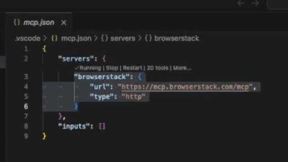
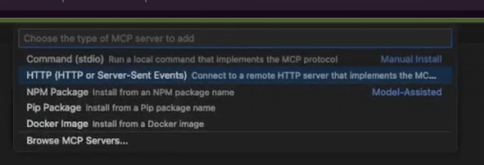
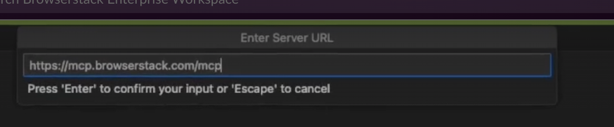
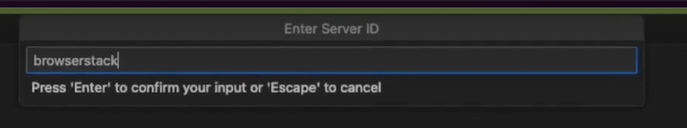
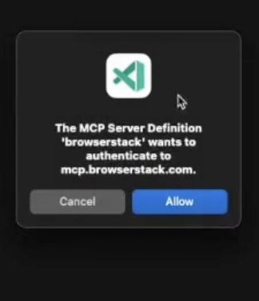
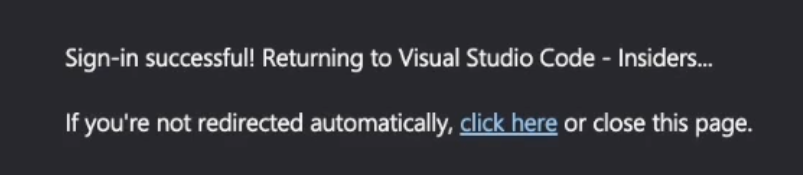

# Remote MCP Server

Remote MCP comes with all the functionalities of an MCP server without the hassles of complex setup or local installation.

## Key benefits

- ✅ Works seamlessly in enterprise networks without worrying about firewalls or binaries or where local installation is not allowed.
- ✅ Secure OAuth integration – no password sharing or manual credential handling.

## Limitations

- ❌ No Local Testing support (cannot test apps behind VPNs, firewalls, or localhost). If you have to do Local Testing, you would have to use a BrowserStack Local MCP server.
- ❌ Latency can be slightly higher, but nothing considerable — you generally won’t notice it in normal use.

## Installation Steps

- VSCode (Copilot - Agent Mode): `.vscode/mcp.json`:

  - Locate or Create the Configuration File:
  - In the root directory of your project, look for a folder named .vscode. This folder is usually hidden so you will need to find it as            mentioned in the expand.
  - If this folder doesn't exist, create it.
  - Inside the .vscode folder, create a new file named mcp.json
  - To setup Remote BrowserStack MCP instead of local BrowserStack MCP you can add the following JSON content :

    

    
    

### Alternative way to Setup Remote MCP

- Step 1.Click on the gear icon to Select Tools

  

   
  

- Step 2. A tool menu would appear at the top-centre, scroll down on the menu at the top and then Click on Add MCP Server

  

   
  

- Step 3. Click on HTTP option

  

  
  

- Step 4. Paste Remote MCP Server URL : https://mcp.browserstack.com/mcp

  

  
  

- Step 5. Give server id as : browserstack

  

  
  

- Step 6. In VSCode Click on start MCP Server and then click on "Allow"

  

  
  

  

  
  

  

  
  

